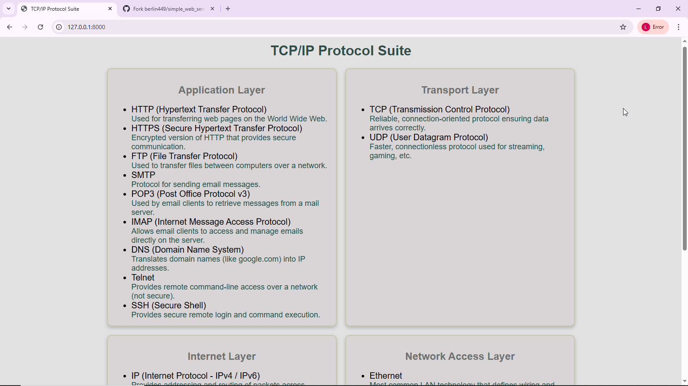
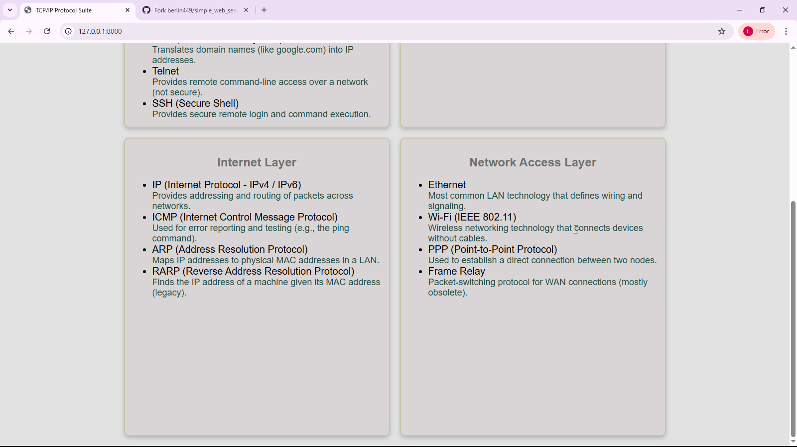
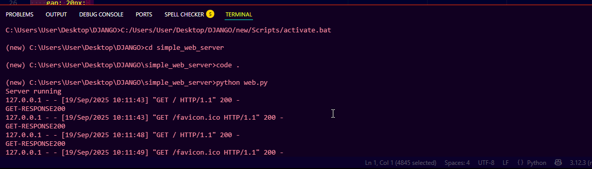

# EX01 Developing a Simple Webserver

# Date:19/09/2025
# AIM:
To develop a simple webserver to serve html pages and display the configuration details of laptop.

# DESIGN STEPS:
## Step 1:
HTML content creation.

## Step 2:
Design of webserver workflow.

## Step 3:
Implementation using Python code.

## Step 4:
Serving the HTML pages.

## Step 5:
Testing the webserver.

# PROGRAM:
```
from http.server import HTTPServer, BaseHTTPRequestHandler

content = '''
<!DOCTYPE html>
<html lang="en">
<head>
    <meta charset="UTF-8">
    <title>TCP/IP Protocol Suite</title>
<style>
body {
    background-color: #E2E2E2;
    font-family: Arial, sans-serif;
    margin: 20px;
}

h1 {
    text-align: center;
    color: #384D48;
}

.flexcontainer {
    display: flex;
    flex-direction: row;  
    flex-wrap: wrap;      
    justify-content: center; 
    gap: 20px; 
}

.layer {
    width: 500px;
    height: 70vh;                
    background-color: #D8D4D5;
    padding: 15px;
    border-radius: 10px;
    border: 2px solid #C7C7A6;    
    box-shadow: 0 4px 8px rgba(0,0,0,0.2);
}

.layer h2 {
    text-align: center;
    color: #6E7271;
}
.desc {
    font-size: 18px;
    color: #2E4E46;
}
li{
    font-size: 20px;
    color:black;
}
</style>

</head>
<body>
    <h1>TCP/IP Protocol Suite</h1>
    <div class="flexcontainer">

    <div class="layer">
        <h2>Application Layer</h2>
        <ul>
            <li>HTTP (Hypertext Transfer Protocol) 
                <div class="desc">Used for transferring web pages on the World Wide Web.</div>
            </li>
            <li>HTTPS (Secure Hypertext Transfer Protocol) 
                <div class="desc">Encrypted version of HTTP that provides secure communication.</div>
            </li>
            <li>FTP (File Transfer Protocol) 
                <div class="desc">Used to transfer files between computers over a network.</div>
            </li>
            <li>SMTP 
                <div class="desc">Protocol for sending email messages.</div>
            </li>
            <li>POP3 (Post Office Protocol v3) 
                <div class="desc">Used by email clients to retrieve messages from a mail server.</div>
            </li>
            <li>IMAP (Internet Message Access Protocol) 
                <div class="desc">Allows email clients to access and manage emails directly on the server.</div>
            </li>
            <li>DNS (Domain Name System) 
                <div class="desc">Translates domain names (like google.com) into IP addresses.</div>
            </li>
            <li>Telnet 
                <div class="desc">Provides remote command-line access over a network (not secure).</div>
            </li>
            <li>SSH (Secure Shell) 
                <div class="desc">Provides secure remote login and command execution.</div>
            </li>
        </ul>
    </div>
        <div class="layer">
        <h2>Transport Layer</h2>
        <ul>
            <li>TCP (Transmission Control Protocol) 
                <div class="desc">Reliable, connection-oriented protocol ensuring data arrives correctly.</div>
            </li>
            <li>UDP (User Datagram Protocol) 
                <div class="desc">Faster, connectionless protocol used for streaming, gaming, etc.</div>
            </li>
        </ul>
    </div>
        <div class="layer">
        <h2>Internet Layer</h2>
        <ul>
            <li>IP (Internet Protocol - IPv4 / IPv6) 
                <div class="desc">Provides addressing and routing of packets across networks.</div>
            </li>
            <li>ICMP (Internet Control Message Protocol) 
                <div class="desc">Used for error reporting and testing (e.g., the ping command).</div>
            </li>
            <li>ARP (Address Resolution Protocol) 
                <div class="desc">Maps IP addresses to physical MAC addresses in a LAN.</div>
            </li>
            <li>RARP (Reverse Address Resolution Protocol) 
                <div class="desc">Finds the IP address of a machine given its MAC address (legacy).</div>
            </li>
        </ul>
    </div>
        <div class="layer">
        <h2>Network Access Layer</h2>
        <ul>
            <li>Ethernet 
                <div class="desc">Most common LAN technology that defines wiring and signaling.</div>
            </li>
            <li>Wi-Fi (IEEE 802.11) 
                <div class="desc">Wireless networking technology that connects devices without cables.</div>
            </li>
            <li>PPP (Point-to-Point Protocol) 
                <div class="desc">Used to establish a direct connection between two nodes.</div>
            </li>
            <li>Frame Relay 
                <div class="desc">Packet-switching protocol for WAN connections (mostly obsolete).</div>
            </li>
        </ul>
    </div></div>

</body>
</html>

'''


class MyServer(BaseHTTPRequestHandler):
    def do_GET(self):
        self.send_response(200)
        print("GET-RESPONSE200")
        self.send_header("Content-type", "text/html")
        self.end_headers()
        self.wfile.write(content.encode())

print("Server running")
server_address = ('', 8000)
httpd = HTTPServer(server_address, MyServer)
httpd.serve_forever()
```
# OUTPUT:



# RESULT:
The program for implementing simple webserver is executed successfully.
